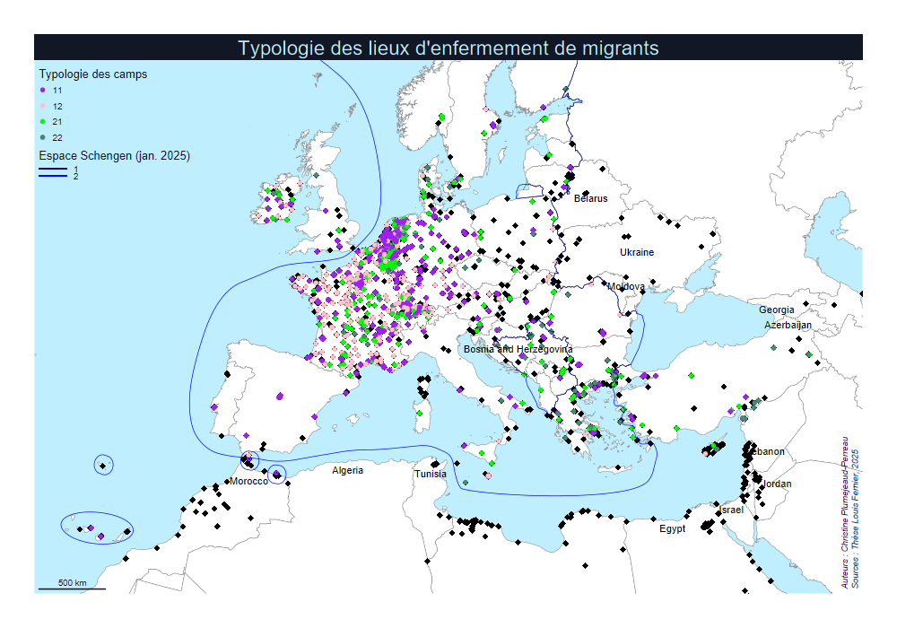
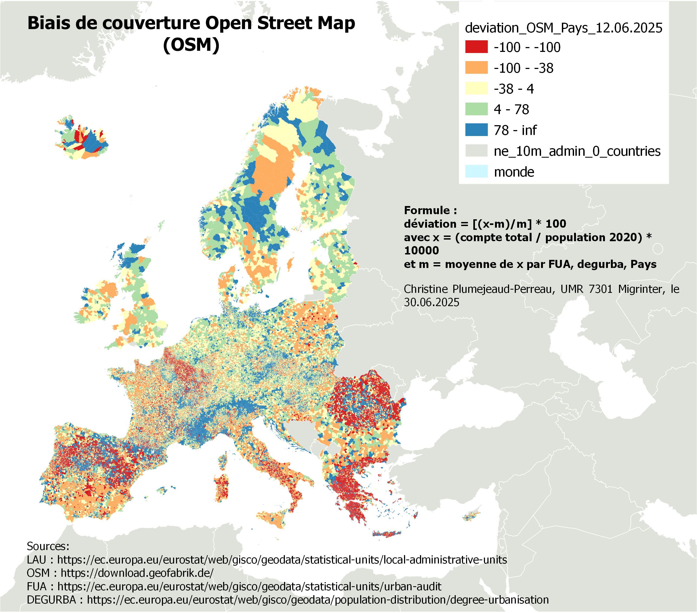

# camps
Caractériser la nature des camps, SAGEO 2025, thèse Louis Fernier

## Contact

Auteur : Christine Plumejeaud-Perreau, UMR 7301 Migrinter
cplumejeaud@gmail.com
christine.perreau@univ-poitiers.fr

## Licence libre

Code déposé sous Licence libre GNU Affero GPL v3
https://www.gnu.org/licenses/agpl-3.0.fr.html

## Traitements spatiaux visant à caractériser les camps de migrants en Europe

 

## Quantifier le biais de renseignement OSM

 

