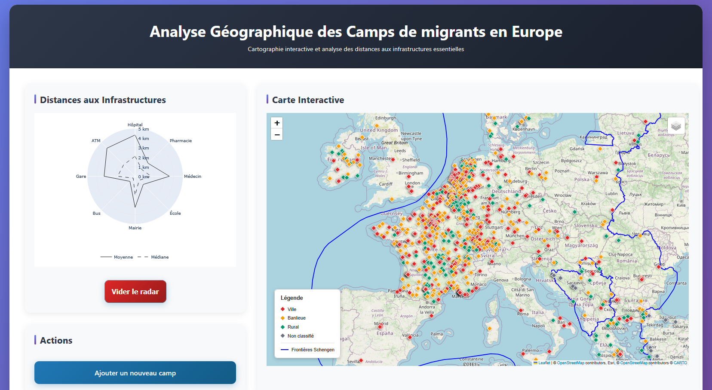

# webapp eurocamps.plumegeo.fr

Cette application propose une visualisation interactive des camps en Europe, base de données complétée et qualifiée de mars 2025, en collaboration avec Louis Fernier, doctorant à Migrinter. 

L'application a d'abord été développée dans le cadre du <i>Master 2 SPE à La Rochelle, UE Data to Information</i>, en décembre 2025, sous la responsabilité de <a href="https://migrinter.cnrs.fr/membres/christine-plumejeaud-perreau/">Christine Plumejeaud-Perreau</a>, 
enseignante de l'UE par des étudiants du Master 2 SPE : 
<ul>
  <li>Damien Glo,</li>
  <li>Killian Lheote,</li>
  <li>Joseph Fournier.</li>
</ul>
<br>C'était un <b>prototype</b> visant à démontrer les capacités d'exploration et visualisation des profils des camps avec Python (3.10). 
Entre décembre 2025 et mars 2026, des améliorations ont été apportées pour une utilisation en production, en particulier pour le formulaire de saisie de nouveaux camps qui ne fonctionnait pas. 
Le code source est disponible sur le github de l'enseignante, sous licence Affero GPL v3.

## Allure de l'application le 05 décembre 2025, rendue par les étudiants



Attention "Ajouter un nouveau camps" ne marche pas. Ce sera modifié plus tard.

## Installation

http://eurocamps.plumegeo.fr

### environnement virtuel et wsgi

Si nécessaire, le fichier wsgi peut être édité avec *vi* ou *nano* sous Linux. Voir ce site https://www.linuxtricks.fr/wiki/guide-de-sur-vi-utilisation-de-vi

`vi eurocamps.wsgi`
```py
import sys
sys.path.insert(0, '/var/www/eurocamps')

from Code_projet_Vfinale import app as application
```

Installation d'un environnement virtuel pour python 3.10 dans ce répertoire
`cd ~/eurocamps`
`python3.10  -m venv py310-venv`

Environnement virtuel dans : 
- /home/cperreau/eurocamps/py310-venv

**entrer**
`source py310-venv/bin/activate`

**installer des packages listés dans un fichier requirements_venv.txt**
`pip3 install -r ../requirements_20251206.txt`

**intaller le module WSGI** / Successfully installed mod_wsgi-5.0.2
`pip install mod_wsgi --use-pep517`

`mod_wsgi-express module-config`
```sh
LoadModule wsgi_module "/home/cperreau/eurocamps/py310-venv/lib/python3.10/site-packages/mod_wsgi/server/mod_wsgi-py310.cpython-310-x86_64-linux-gnu.so"
WSGIPythonHome "/home/cperreau/eurocamps/py310-venv"
```

**sortir**
`deactivate`

### config Apache2

Supprimer mes Ctrl^M génants de Windows parfois
```sh
for fic in $(find /home/cperreau/eurocamps -type f -name "*.py"); do sudo dos2unix $fic; done
```

Attention, il faut qu'Apache2 (user :www-data) ait accès à votre environnement virtuel (en lecture et exécution, r+x)
```sh
sudo chown :www-data /home/cperreau/eurocamps/ -R
sudo chmod 755 /home/cperreau/eurocamps/ -R
```
Lier les sources à un répertoire fictif apache
`sudo ln -s  /home/cperreau/eurocamps/ /var/www/eurocamps`

DNS : eurocamps.plumegeo.fr
créer un mapping sur votre fournisseur de DNS : CNAME avec romarin.huma-num.fr.

Sur le serveur, éditer le fichier Code_projet_Vfinale.py pour modifier le chemin vers les données (camps8_18-03-2025-sansNAniOUTLIERS.csv et le shapefile Espace_Schengen_ligne.shp)
`vi Code_projet_Vfinale.py`

```sh
FILE_PATH = r"/var/www/eurocamps/camps8_18-03-2025-sansNAniOUTLIERS.csv"
SHAPEFILE_PATH = r"/var/www/eurocamps/Espace_Schengen_ligne/Espace_Schengen_ligne.shp"
```

Editer fichier de config **eurocamps.conf** ci-dessous

`sudo vi /etc/apache2/sites-available/eurocamps.conf`
```sh
<VirtualHost *:80>
    ServerName eurocamps.plumegeo.fr
    DocumentRoot /var/www/eurocamps

    LoadModule wsgi_module "/home/cperreau/eurocamps/py310-venv/lib/python3.10/site-packages/mod_wsgi/server/mod_wsgi-py310.cpython-310-x86_64-linux-gnu.so"
    WSGIDaemonProcess eurocamps python-home="/home/cperreau/eurocamps/py310-venv"
    WSGIProcessGroup eurocamps

    WSGIApplicationGroup %{GLOBAL}

    WSGIScriptAlias / /var/www/eurocamps/eurocamps.wsgi

    <Directory /var/www/eurocamps>
        Require all granted
    </Directory>

</VirtualHost>

```

`sudo a2ensite eurocamps` Pour démarrer la webapp
`sudo a2dissite eurocamps` Pour retirer la webapp

`sudo systemctl reload apache2` pour recharger la config et le code de la Webapp
`sudo systemctl restart apache2.service` pour stopper/redémarrer apache2

`sudo systemctl status apache2.service` : état du service Apache2

`sudo vi /var/log/apache2/error.log` : debugger et regarder les traces de la webapp

### Servir des couches de vecteurs tuilées

#### Générer les tuiles avec tippecanoe

voir https://github.com/felt/tippecanoe

tippecanoe -zg -o out.mbtiles --drop-densest-as-needed in.geojson

pour créer des geojson avec les données : 
- https://mapshaper.org/
- https://github.com/mbloch/mapshaper/wiki/Command-Reference#-o-output

Placer les données dans /data/camps/

- Lire https://github.com/Leaflet/Leaflet.VectorGrid/issues/248
use uncompressed pbf tiles : you can generate uncompressed tiles with tippecanoe --no-tile-compression

cd /data/camps/

Créer la layer de fua

`tippecanoe -o uncompressed_fua.mbtiles --force -X -l cities -n "Functionnal Urban Area (Eurostat 2020)" -Z4 -z10 --drop-densest-as-needed --no-tile-compression URAU_RG_100K_2020_4326.json` 

chmod a+x /data/camps/uncompressed_fua.mbtiles

Avoir créer les geojson filtrés (degurba_01, degurba_02, degurba_03) avant et construire les mbtiles correspondants (3 layers de degurba)

`tippecanoe -o uncompressed_degurba01.mbtiles --force -n "Degree 1 of Urbanisation (Eurostat 2018)" -l degurba01 -Z7 -z11 -x POPULATION --coalesce-densest-as-needed --extend-zooms-if-still-dropping --drop-densest-as-needed --no-tile-compression degurba_01.geojson` 

`tippecanoe -o uncompressed_degurba02.mbtiles --force -n "Degree 2 of Urbanisation (Eurostat 2018)" -l degurba02 -Z7 -z11 -x POPULATION  --coalesce-densest-as-needed --extend-zooms-if-still-dropping --drop-densest-as-needed --no-tile-compression degurba_02.geojson` 

`tippecanoe -o uncompressed_degurba03.mbtiles --force -n "Degree 3 of Urbanisation (Eurostat 2018)" -l degurba03 -Z7 -z11 -x POPULATION --coalesce-densest-as-needed --extend-zooms-if-still-dropping --drop-densest-as-needed --no-tile-compression degurba_03.geojson`

Réunir les trois layers degurba

`tile-join --force --no-tile-compression -o uncompressed_degurba.mbtiles -n "DEGURBA (Eurostat 2018)" uncompressed_degurba01.mbtiles uncompressed_degurba02.mbtiles uncompressed_degurba03.mbtiles`  

chmod a+x /data/camps/*.mbtiles

#### 2.4.3.2. Servir les tuiles avec vtiles
https://pypi.org/project/vtiles/

Use `servevectormbtiles` to Serve vector tiles for the input MBTiles file, so clients can access to the tiles server via, for ex. http://localhost/8000/vectortiles/z/x/y.png. 

`servevectormbtiles --serve -p <port> -f <input file>`

Environnement virtuel dans : 
- /home/cperreau/eurocamps/py310-venv


`source py310-venv/bin/activate`

`pip3 install vtiles --upgrade`
`pip3 install pyclipper`

```sh
Installing collected packages: ujson, tqdm, shapely, requests, protobuf, jmespath, click, attrs, cligj, click-plugins, botocore, s3transfer, fiona, boto3, vtiles
  Attempting uninstall: shapely
    Found existing installation: shapely 2.1.2
    Uninstalling shapely-2.1.2:
      Successfully uninstalled shapely-2.1.2
  Attempting uninstall: requests
    Found existing installation: requests 2.32.5
    Uninstalling requests-2.32.5:
      Successfully uninstalled requests-2.32.5
  Attempting uninstall: click
    Found existing installation: click 8.3.1
    Uninstalling click-8.3.1:
      Successfully uninstalled click-8.3.1
Successfully installed attrs-25.4.0 boto3-1.34.162 botocore-1.34.162 click-8.1.8 click-plugins-1.1.1.2 cligj-0.7.2 fiona-1.10.1 jmespath-1.0.1 protobuf-5.26.1 requests-2.31.0 s3transfer-0.10.4 shapely-2.0.7 tqdm-4.66.6 ujson-5.11.0 vtiles-1.0.7
```


Récupérer les métadonnées 
/home/cperreau/eurocamps/py310-venv/bin/mbtilesinfo  uncompressed_fua.mbtiles
/home/cperreau/eurocamps/py310-venv/bin/mbtilesinfo  uncompressed_degurba.mbtiles

ps -ef | grep servevectormbtiles
kill -9 <PID>

cd /home/cperreau/eurocamps

`nohup /home/cperreau/eurocamps/py310-venv/bin/servevectormbtiles --serve -p 8080 -f /data/camps/uncompressed_fua.mbtiles > servertiles_out.txt &`
-- OK port 8080

`nohup /home/cperreau/eurocamps/py310-venv/bin/servevectormbtiles --serve -p 8081 -f /data/camps/uncompressed_degurba.mbtiles > degurbaservertiles_out.txt &`
-- OK port 8081


Tester
 - curl http://127.0.0.1:8080/fua/metadata
 - http://vtiles.plumegeo.fr/fua/metadata
 - http://vtiles.plumegeo.fr/degurba/metadata
  
DNS : vtiles.plumegeo.fr
créer un mapping sur votre fournisseur de DNS : CNAME avec romarin.huma-num.fr.

Editer le fichier de config **vtiles.conf** ci-dessous

lire : 
- https://github.com/maplibre/martin/issues/19
- https://www.alsacreations.com/article/lire/1938-La-notion-d-origine-web-et-CORS.html

`sudo vi /etc/apache2/sites-available/vtiles.conf`
```sh
 <VirtualHost *:80>
    ServerName vtiles.plumegeo.fr
    ServerAdmin cplumejeaud@gmail.com

    <Proxy *>
                Allow from localhost
    </Proxy>
    ProxyPass /fua http://127.0.0.1:8080/
    ProxyPassReverse /fua http://127.0.0.1:8080/

    ProxyPass /degurba http://127.0.0.1:8081/
    ProxyPassReverse /degurba http://127.0.0.1:8081/

    ProxyPreserveHost on
    # 3. Configuration CORS
    #proxy_set_header        X-Forwarded-Proto $scheme;
    <IfModule mod_headers.c>
        Header set Access-Control-Allow-Origin "*"
        Header set Access-Control-Allow-Methods "GET, POST, OPTIONS"
        Header set Access-Control-Allow-Headers "Content-Type"
    </IfModule>
</VirtualHost>
```

    
`sudo a2ensite vtiles` Pour démarrer la webapp
`sudo a2dissite vtiles` Pour retirer la webapp

`sudo systemctl reload apache2` pour recharger la config et le code de la Webapp
`sudo systemctl restart apache2.service` pour stopper/redémarrer apache2

`sudo systemctl status apache2.service` : état du service Apache2

`sudo vi /var/log/apache2/error.log` : debugger et regarder les traces de la webapp

--- sur windows 
```sh
cd C:\Christine\Dev\
conda create -n anaconda310-venv python=3.10 anaconda
conda activate anaconda310-venv
conda install --file .\camps\webapp\requirements_20251206.txt 
pip install branca
pip install flask-cors
```

Lancer le serveur comme un process (à redémarrer avec la machine)
- https://doc.ubuntu-fr.org/tutoriel/comment_transformer_un_programme_en_service

mkdir /home/cperreau/vtiles


vi servevtiles
```sh
#!/bin/sh -e
    #
    ### BEGIN INIT INFO
    # Provides:          servevtiles
    # Required-Start:    $all
    # Required-Stop:
    # Default-Start:     2 3 4 5
    # Default-Stop:      0 1 6
    # Short-Description: description du programme
    ### END INIT INFO
     
    DAEMON="/home/cperreau/eurocamps/py310-venv/bin/servevectormbtiles" #ligne de commande du programme, attention à l'extension .py.
    daemon_OPT="--serve -p 8080 -f /data/camps/uncompressed_fua.mbtiles"  #argument à utiliser par le programme - Remplacer Utilisateur par votre nom de login
    DAEMONUSER="cperreau" #utilisateur du programme
    daemon_NAME="servevtiles" #Nom du programme (doit être identique à l'exécutable et de moins de 15 caractères).
    #Attention le script est un script bash, le script ne portera donc pas l'extension .py mais .sh.
     
    PATH="/sbin:/bin:/usr/sbin:/usr/bin" #Ne pas toucher
     
    test -x $DAEMON || exit 0
     
    . /lib/lsb/init-functions
     
    d_start () {
            log_daemon_msg "Starting system $daemon_NAME Daemon as $DAEMONUSER user with exec $DAEMON -- $daemon_OPT"
    	start-stop-daemon --background --name $daemon_NAME --start --quiet --chuid $DAEMONUSER --exec $DAEMON -- $daemon_OPT
            log_end_msg $?
    }
     
    d_stop () {
            log_daemon_msg "Stopping system $daemon_NAME Daemon"
            start-stop-daemon --name $daemon_NAME --stop --retry 5 --quiet --name $daemon_NAME
    	log_end_msg $?
    }
     
    case "$1" in
     
            start|stop)
                    d_${1}
                    ;;
     
            restart|reload|force-reload)
                            d_stop
                            d_start
                    ;;
     
            force-stop)
                   d_stop
                    killall -q $daemon_NAME || true
                    sleep 2
                    killall -q -9 $daemon_NAME || true
                    ;;
     
            status)
                    status_of_proc "$daemon_NAME" "$DAEMON" "system-wide $daemon_NAME" && exit 0 || exit $?
                    ;;
            *)
                    echo "Usage: /etc/init.d/$daemon_NAME {start|stop|force-stop|restart|reload|force-reload|status}"
                    exit 1
                    ;;
    esac
    exit 0
```


sudo cp ~/vtiles/servevtiles /etc/init.d/.
sudo chmod 0755 /etc/init.d/servevtiles

**Idem avec servevtiles81** pour autre paramètres (-p 8081 -f /data/camps/uncompressed_degurba.mbtiles)

sudo cp servevtiles81 /etc/init.d/
sudo chmod 0755 /etc/init.d/servevtiles81

 On reload les daemons du système :

`systemctl daemon-reload`

On teste notre script :

`sudo /etc/init.d/servevtiles start`
* Starting system servevtiles Daemon 

`sudo /etc/init.d/servevtiles81 start`

`sudo /etc/init.d/servevtiles stop`
* Stopping system servevtiles Daemon  

Maintenant on ajoute le service au démarrage de l'ordinateur : 
`sudo update-rc.d servevtiles defaults`
`sudo update-rc.d servevtiles81 defaults`

Pour le retirer :
`sudo update-rc.d -f sabnzbd remove`

Relancer : 
`sudo /etc/init.d/servevtiles restart`
Restarting servevtiles (via systemctl): servevtiles.serviceTerminated

Vérifier : 
```sh
netstat -na | grep 8080
tcp        0      0 0.0.0.0:8080            0.0.0.0:*               LISTEN

ps -ef | grep servevectormbtiles
cperreau   14060       1  0 13:03 ?        00:00:00 /home/cperreau/eurocamps/py310-venv/bin/python3.10 /home/cperreau/eurocamps/py310-venv/bin/servevectormbtiles --serve -p 8080 -f /data/camps/uncompressed_fua.mbtiles
cperreau   14069   10521  0 13:03 pts/1    00:00:00 grep --color=auto servevectormbtiles
```